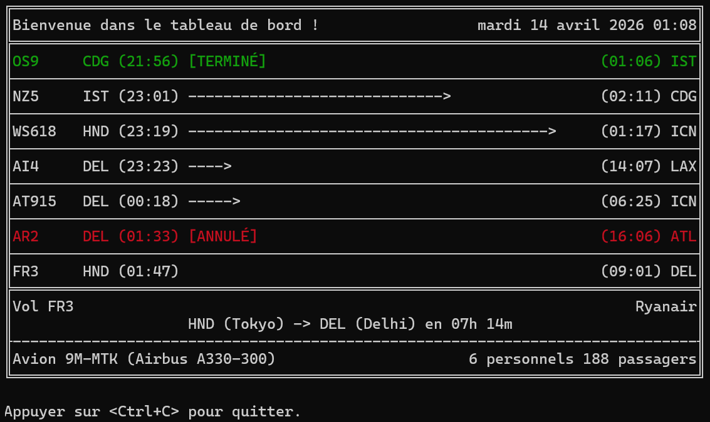
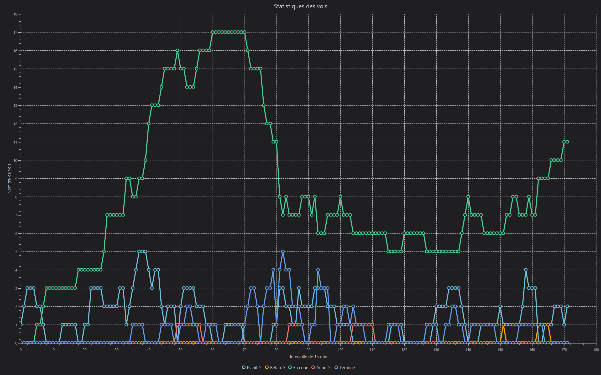

# AppCompagnieAeriennePOO
L'objectif de ce projet est de développer une application qui permet de visualiser les vols de différentes compagnies aériennes.

Mais aussi pour apprendre les notions suivantes :
- POO en java
- automatisation avec maven
- collaboration à travers Github

## Lancer le projet
Une version de Java ≥ à 24 est requise.

Installer Maven depuis le [site officiel](https://maven.apache.org/download.cgi#CurrentMaven) 
Extraire le dossier où vous le voulez et ajouter le chemin du dossier à `PATH`

Puis :
- compiler avec : `mvn clean compile`
- exécuter avec : `mvn exec:java`
