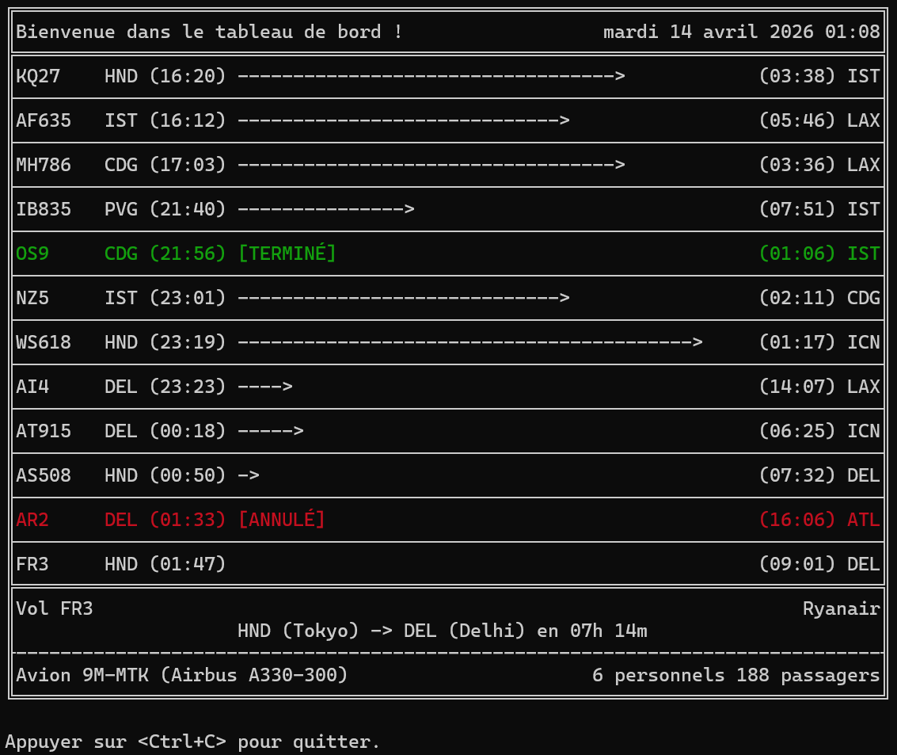

# AppCompagnieAeriennePOO
L'objectif de ce projet est de développer une application qui gère un système de réservation d’une compagnie aérienne avec toutes les fonctionnalités requises en POO.

## Lancer le projet
Une version de Java au-dessus de 14 est requise.

Installer Maven sur le [site officiel](https://maven.apache.org/download.cgi#CurrentMaven) 
Extraire le dossier où vous le voulez et ajouter le chemin du dossier à `PATH`

Puis:
- compiler avec : `mvn clean compile`
- exécuter avec : `java -cp target/classes acap.App`
